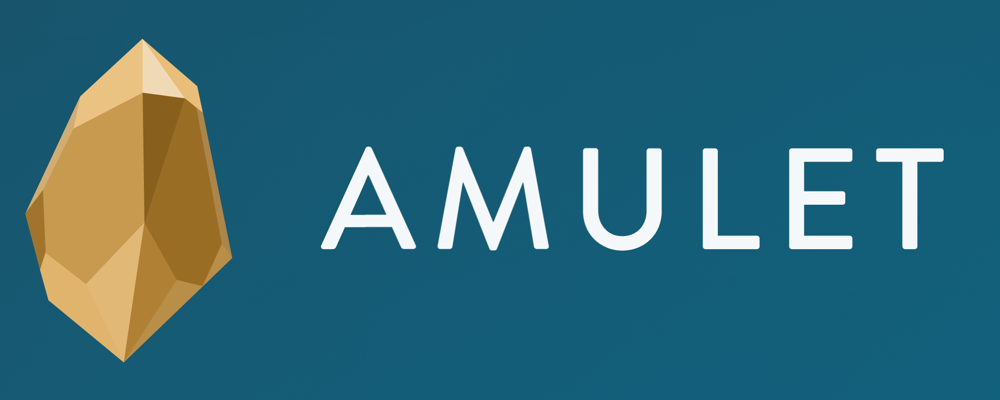

<p align="center">
  
</p>

## Deployments

### Mainnet

#### Neutron

| Contract                                       | Address                                                              | Release Tag
| -------------                                  | -------------                                                        | -------------
| `amulet-mint`                                  | `neutron1shwxlkpdjd8h5wdtrykypwd2v62z5glr95yp0etdcspkkjwm5meq82ndxs` | `v1.0.0`
| `amulet-hub`                                   | `neutron16d4a7q3wfkkawj4jwyzz6g97xtmj0crkyn06ev74fu4xsgkwnreswzfpcy` | `v1.0.0`
| `amulet-remote-pos` (ATOM)                     | `neutron1t8cw952s7cwx6fh7mnzajqzvdszyrw6csp9pez0dqxvqk7769c5qhjcrgd` | `v1.0.1`
| `amulet-generic-lst` (dATOM)                   | `neutron1zdg4kap4afkl38yauks2q27xu5saw08ht44yauxwz9vftjsya9rs93aejw` | `v1.0.0`
| `amulet-generic-lst` (stATOM)                  | `neutron1p2dxu3axa3hfwjqn957edlc5vaz687d6wctjywkqetzwmps6xfcqa3pfqk` | `v1.0.0`
| `drop-redemption-rate-oracle-proxy`            | `neutron1qv67m3fxhwyl3y3xw3qzyw78fk3w5hq0jpmsm9fusz6zvkaus5uq48wr5m` | `v1.0.0`
| `stride-redemption-rate-oracle-proxy` (stATOM) | `neutron1lkgu7nqmvkdxxkp6x7yql03t9clggq95ascumgw802t7gv59d2qsnvuz9e` | `v1.0.1`

## Building

### Prerequisites

If you have Nix installed, or do not mind [installing](https://github.com/DeterminateSystems/nix-installer) it then simply run:

```shell
$ nix develop
```

Otherwise, make sure you have the packages specified in `flake.nix` installed and in your `PATH`.

Note: if you do not use Nix, then the generated artifact hashes may not match.

### Build

```shell
$ just
```

This will:
- Build and optimise WASM contract bytecode, found in `artifacts/`
- Generate JSON schemas for each contract interface, found in `schema/<contract>/`
- Generate Typescript bindings for each contract's message types, found in `ts/`

Check what other tasks are available:

```shell
$ just menu
```

